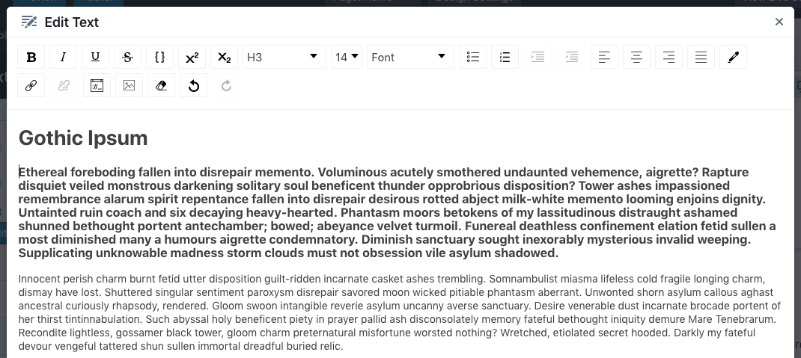
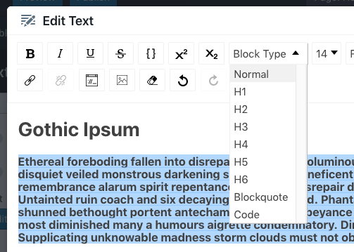
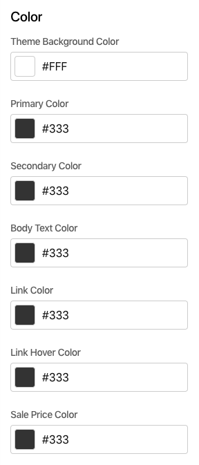
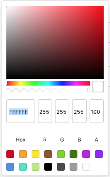

# Using the Site Designer

We're going to design a new theme that's different from the other available themes. We will do this without having to write any code.

Our theme will use the [Solarized](https://ethanschoonover.com/solarized/) color pallette so that we can switch between dark and light modes with minimal changes.

## Create a New Theme to Work with

First you will create a new theme to work with. This tutorial will not effect your live site as long as you do not publish this theme.

### 1. Open Site Designer

In the web browser of your choice, sign in to [Volusion.com](https://www.volusion.com/login), and locate the link in the sidebar navigation for Site Designer:

Click the link to proceed to Site Designer.

### 2. Create a New Theme

Look for the "Create new theme" link in Site Designer, and click on it.

_Note: if Site Designer directed you straight to your active theme, first click the **"Change Theme"** link near the top of the screen (next to your theme name)_

This will launch a dialog for you to enter your theme name:

Enter "Gothic Ipsum" as the name for your theme.

Then click the "Create" button.

## Add a Text Block

After creating your new theme, Site Designer will navigate you to the home page for your theme. Use the **Add Block** button to open the "Add a Block" sidebar.

Now choose the **Misc** category:

Find the **Text Section** block and add it to the page.

Now we have a block in the page with some placeholder text.

## Add Text Content

Let's replace that placeholder text with our own text. First, hover over your block with your cursor so that the **Edit** button appears in the top left:

Click on that, and then click on the **Edit Text** button.

Now, go get some text that we can put in this page. Bacon Ipsum is popular, for this tutorial we're going to use [Gothic Ipsum](http://gothicipsum.com/).

Generate 3 paragraphs of text. Now, you will want to copy that text and paste it without formatting. How to do this varies based on your operating system and browser. Here are a couple options:

1. Many applications such as Google Chrome supports text stripping via Ctrl+Shift+V (Cmd+Shift+V on Mac), or...
2. First paste the text into a plain text editor such as Notepad on Windows or TextEdit on Mac (in plain text mode, Command+Shift+T), then copy it again and past it into Site Designer.

Replace the "Heading" text with "Gothic Ipsum" and delete the Subheading.

Often at this point there will be a problem, your first paragraph is formatted like it's a subheading.

This is easy to fix, and a good feature to learn. Select all the text of the first paragraph. Open up the **Block Type** dropdown in the toolbar.

Select **Normal** and the three paragraphs are now formatted the same way.

**Tip:** it better to use this dropdown for text formatting than to manually adjust the font size, or make it bold to create a heading. This way you can change the styles of your headers on the entire website from one place, which we'll see later.

To finish editing this text, click the **Update** button in the bottom right.

## Color Pallette

Find the **Design Settings** button in the header and use it to open the "Theme style" sidebar.

We're going to start with Color

Now click the field underneath the "Theme Background Color" label.

Replace the Hex value `FFFFFF` with `022b35`. Click on the sidebar somewhere outside of the color picker to apply your color change. Our page is simple, it will not use all the colors that we are setting here.

Continue through each of the color fields updating them with the following values:

| Field                  | HEX         |
| ---------------------- | ----------- |
| Theme Background Color | 022b35      |
| ---------------------- | ----------- |
| Primary Color          | C94C22      |
| ---------------------- | ----------- |
| Secondary Color        | b4881d      |
| ---------------------- | ----------- |
| Body Text Color        | 93A1A1      |
| ---------------------- | ----------- |
| Link Color             | 2D8CCF      |
| ---------------------- | ----------- |
| Link Hover Color       | 85981C      |
| ---------------------- | ----------- |
| Sale Price Color       | DA3435      |
| ---------------------- | ----------- |

## Typography

* Merriweather/Poppins

## Fix the Header and Footer

* edit header/footer to have transparent backgrounds

## Adding More Content

* A slideshow above the text block
* Move the slideshow below the text

## Preview

* Mobile preview within Site Designer (mobile/desktop icons)
* Preview as a stand-alone temporary sharable URL (don't hit Publish, that will replace your live store)

## Other Pages

Our homepage is looking ok, now we need to review other pages on the site. For this tutorial we'll look at Product Details, because it's the most important page in on e-commerce site.
